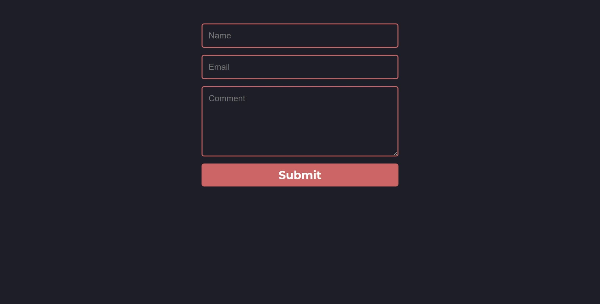

# Petite Vue Form

This is a CRUD project using [Petite Vue](https://github.com/vuejs/petite-vue).



Included  features :

- Module bundling with [Parcel](https://parceljs.org/)
- Deleting directories with [Rimraf](https://github.com/isaacs/rimraf)

## Install:

```
npm install
```

## To run:

```
npm start
```

Open browser on [http://localhost:1234](http://localhost:1234) to view the app.

## To build:

```
npm run build
```

## To clean:

```
npm run clean
```

## Credits
* [Bjorn Krols](https://technotrampoline.com/articles/building-an-ajax-form-with-petite-vue)
* [Zach Saucier](https://codepen.io/ZachSaucier/pens/public)
